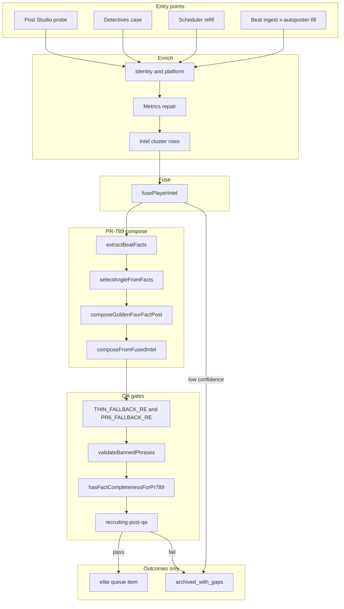

# Elite Recruiting Intel Operator Spec

Operator-facing specification for PR-789 elite compose, Detectives Engine v2.0, and recruiting player intel automation only (not team roster, portal, or general beat news outside recruiting slugs).

## Executive truth table

| Statement | Operator truth | Evidence / gate |
| --- | --- | --- |
| Elite posts must come from fused beat facts, not PR-6 templates | **TRUE** | `composeFromFusedIntel` blocks `PR6_FALLBACK_RE`; `composeGoldenFourFactPost` is the sole angle composer |
| Thin copy is a **generation** leak, not a detection gap | **TRUE** | Keep `THIN_FALLBACK_RE` as guard in `golden-four-compose.js`; remove thin **generation** paths, not thin-signal detection in `fusePlayerIntel` |
| Autoposter has exactly two elite outcomes | **TRUE (target)** | **elite** queue item OR **archived_with_gaps** (no third best-effort publish tier for Tier A/B recruiting intel) |
| Detectives must converge on the same compose stack as Post Studio probe | **TRUE (target)** | Shared pipeline: enrich, `fusePlayerIntel`, `composeFromFusedIntel`, recruiting QA |
| Route, block, delete (never delete day 1) | **TRUE** | Misroutes go to block/archive first; physical delete only after operator sign-off and leak postmortem |
| Scope is recruiting **player intel** only | **TRUE** | Golden slugs, fused intel rows, Detectives cases tied to `playerSlug` |
| `X_AUTOPOST_PR789_ONLY_RECRUITING=true` gates live publish | **TRUE (required in prod)** | When true, non-recruiting categories cannot pick PR-789 angle tiers at publish time |

## Execution gates G1-G4

| Gate | Name | Pass criteria |
| --- | --- | --- |
| **G1 - Wire** | Routing | All Tier A/B intel entry points call `fusePlayerIntel` then elite compose; Detectives v2 uses `detectives-elite-compose.js` |
| **G2 - See** | Observability | `composeProbe` returns `fuse`, `eliteBuild`, `publishGate`; Detectives emits telemetry JSON on every terminal phase |
| **G3 - Cover** | Golden coverage | Groups A-D acceptance tests PASS for slugs: `cale-britt`, `zyon-robinson`, `kalu-thomas`, `bryce-willingham`, `merrick-ham`, `fujikawa` |
| **G4 - Kill leaks** | No fallback publish | Zero production posts matching `PR6_FALLBACK_RE` or `THIN_FALLBACK_RE`; no `n2_pr6_fallback` when flag requires PR-789 only |

### Feature flag

```bash
X_AUTOPOST_PR789_ONLY_RECRUITING=true
```

When enabled, publish routing must not select legacy PR-6 or generic voice tiers for recruiting intel queue items. Shadow tiers remain diagnostics-only unless explicitly promoted in Post Studio.

Related live flags (existing code): `X_AUTOPOST_PR789_ANGLE_GOLDEN_LIVE`, `X_AUTOPOST_DETECTIVES_ENABLED`, `X_AUTOPOST_VOICE_REQUIRED`.

### Policy reminders

- **Keep `THIN_FALLBACK_RE` as guard** (`server/lib/autoposter/rewrite/compose-synonym-rotation.js`, re-exported from `golden-four-compose.js`). Detection of thin intel (`thin_beat_intel` gap in `fusePlayerIntel`) stays; **do not** generate compensating thin tweets.
- **Route to block to delete, not delete day 1**: use `player-resolution-ledger` archive reasons first; deletion is a later hygiene action.
- **Scope**: recruiting player intel automation only.

## Milestones (weeks 1-3)

| Week | Deliverable | Exit |
| --- | --- | --- |
| **1** | G1 wiring plus `detectives-elite-compose.js` integrated behind flag | Probe shows `eliteBuild.ok` for at least four golden slugs locally |
| **2** | Detectives v2 pipeline and telemetry schema frozen; Post Studio panel reads probe | Groups A-B PASS; no PR-6/thin leak in shadow compose |
| **3** | Scheduler and beat ingest parity; operator sign-off | Groups C-D PASS; G4 verified on staging; flag on prod |

## Operator sign-off checklist

- [ ] Executive truth table reviewed with engineering
- [ ] G1-G4 evidence attached (probe JSON, telemetry samples, test run IDs)
- [ ] Golden slug matrix PASS (six known slugs plus regression spot checks)
- [ ] Forbidden paths table reviewed
- [ ] Misroute handling confirmed: archive/block before delete
- [ ] Feature flag state documented for prod and staging
- [ ] Sign-off name, date, environment

---

## 1. Detectives Engine v2.0

### Goal

Close Detectives salvage loops by promoting the same elite PR-789 compose used by beat ingest and Post Studio probe, instead of parallel voice or beat-driven templates that reintroduce PR-6 or thin phrasing.

### Current vs target

| Area | Current (v1) | Target (v2.0) |
| --- | --- | --- |
| Primary promote path | `detectives-strategies.js` to voice promote via `detectives-promote.js` | Elite path via **`detectives-elite-compose.js`** then `fusePlayerIntel` then `composeFromFusedIntel` |
| Intel fusion | Ad hoc hints plus metrics repair | Mandatory `fusePlayerIntel(slug)` with confidence and gaps |
| Compose | `voice-engine.js` / `x-autoposter-copy.js` branches | `composeGoldenFourFactPost` / `composeFromFusedIntel` only for Tier A/B |
| Failure terminal | `resolved_archive` with skip codes | **`archived_with_gaps`** when compose or QA fails but case needs ops review |
| Success terminal | `resolved_publish` queued item | **elite** queue item with `validationMeta.eliteCompose` |
| QA | `recruiting-post-qa.js` on candidate | Same QA after compose; reject archives, no thin retry |

### Pipeline (v2)

```text
enrich -> fuse -> composeFromFusedIntel -> QA
```

| Stage | Responsibility | Primary modules |
| --- | --- | --- |
| **enrich** | Identity, platform prospect, metrics repair, beat text normalization | `detectives.js`, `detectives-platform.js`, `detectives-metrics.js` |
| **fuse** | Cluster intel, score confidence, gaps, publishAction | `fuse-player-intel.js` (`fusePlayerIntel`) |
| **composeFromFusedIntel** | PR-789 angle tweet from fused beat text and On3 context | `compose-from-fused-intel.js`, `golden-four-compose.js`, `beat-fact-extractor.js` |
| **QA** | Publish gate, banned phrases, char limit | `recruiting-post-qa.js`, `fact-gates.js` |

### Triggers

| Trigger | Source | v2 behavior |
| --- | --- | --- |
| Manual tick | Detectives process admin route / scheduler background tick | `investigateCase` tries elite compose before legacy strategies (flag-gated) |
| Skip-reason salvage | Autoposter queue skip to Detectives case | Classifier marks salvageable; elite compose when fuse allows |
| Beat ingest handoff | `detectives-handoff.js` | Normalize slug, fuse, compose (no duplicate voice path) |
| Golden four pending | `x-autoposter-fill.js` `tryAutonomousGoldenFourRefill` | Must not bypass fused elite compose for Tier A/B intel rows |

### Telemetry JSON schema (Detectives)

Emitted via `logDetectives()` to `ops-monitor` `logEvent` (`subsystem: autoposter:detectives`).

```json
{
  "subsystem": "autoposter:detectives",
  "status": "success | skipped | error",
  "message": "detectives:resolved | detectives:<phase>",
  "details": {
    "ok": true,
    "caseId": "string",
    "phase": "start | identity | platform | strategies | resolved_publish | resolved_archive | reject",
    "path": "elite_fused | voice_promote | strategy_N",
    "playerSlug": "string",
    "skipReason": "string | null",
    "primaryCode": "string | null",
    "archiveReason": "string | null",
    "attempts": 0,
    "gaps": ["string"],
    "fuse": {
      "confidence": 0.0,
      "publishAction": "publish | hold | archive",
      "gapCount": 0,
      "beatLen": 0
    },
    "compose": {
      "ok": true,
      "reason": "string | null",
      "composePath": "pr789_beat_facts | elite_pr789",
      "dominantAngle": "string | null",
      "outcome": "elite | archived_with_gaps"
    },
    "beatDrivenOnly": false,
    "preFlight": false
  }
}
```

### Implementation file touchpoints

| File | Role |
| --- | --- |
| `server/lib/autoposter/detectives.js` | Case orchestration, `investigateCase` |
| `server/lib/autoposter/detectives-strategies.js` | Legacy strategy ordering; v2 delegates to elite module first |
| `server/lib/autoposter/detectives-promote.js` | Queue promotion metadata (`pr789Live`, shadows) |
| `server/lib/autoposter/detectives-classifier.js` | Salvageability and gap diagnosis |
| `server/lib/autoposter/detectives-resolution.js` | Terminal publish/archive resolution |
| `server/lib/autoposter/detectives-scheduler.js` | Background ticks |
| `server/lib/autoposter/rewrite/beat-fact-extractor.js` | Fact and angle extraction |
| `server/lib/player-intelligence/fuse-player-intel.js` | `fusePlayerIntel` |
| `server/lib/player-intelligence/compose-from-fused-intel.js` | `composeFromFusedIntel` |
| `server/lib/player-intelligence/golden-four-compose.js` | `composeGoldenFourFactPost` |
| `server/lib/x-autoposter-fill.js` | Beat ingest build path, `probeIntelAutoposterPath` |
| `server/lib/x-autoposter-routes.js` | Probe and republish routes |

### New module: `detectives-elite-compose.js`

**Path (new):** `server/lib/autoposter/detectives-elite-compose.js`

**Contract:**

```js
async function composeDetectivesEliteCase({ slug, hints, identity, fused: prefused }) {
  // 1. fused = prefused || await fusePlayerIntel(slug, { persist: true })
  // 2. composed = composeFromFusedIntel(fused)
  // 3. optional: buildEliteRepublishPost when ranking cache complete
  // 4. return { outcome: "elite" | "archived_with_gaps", composed, fused, qa }
}
```

**Rules:**

- Never enqueue when compose hits `pr6_fallback_blocked`, `THIN_FALLBACK_RE`, or banned phrases.
- Map QA failure to `archived_with_gaps` with gaps copied from fuse and compose reasons.
- Set `validationMeta.detectivesPath = "elite_fused"` and propagate `composePath` from golden compose.

---

## 2. PR-789 Unified Compose Architecture

Unified compose means one fact pipeline (`extractBeatFacts` -> `selectAngleFromFacts` -> `composeFromFacts`) backing Post Studio probe, beat ingest, Detectives, scheduler refill, and golden-four enqueue.

### Mermaid flowchart



### Eight signal classes

Primary PR-789 signal taxonomy from `classifySignals()` in `beat-fact-extractor.js` (operator-facing eight; extended tags may co-exist):

| # | Signal class | Meaning |
| --- | --- | --- |
| 1 | `staff_pitch` | UF staff direct pitch messaging |
| 2 | `staff_energy` | Staff energy, daily contact, relationship building |
| 3 | `quote_driven` | Player or staff quote usable after paraphrase rules |
| 4 | `visit` | Dated or contextual campus visit |
| 5 | `board` | Board, radar, geographic board stretch signals |
| 6 | `program_pitch` | Program or coaching tradition standing out |
| 7 | `offer_interest` | Mutual interest, HC offer, early attention |
| 8 | `competition` | RPM top schools, comp battle framing |

Extended tags: `head_coach_offer`, `geographic`, `follow_up`.

### Angle arcs (15-20)

Dominant **angle** keys from `selectAngleFromFacts` (maps to `composeFromFacts` narratives):

1. `geographic_board_quote`
2. `geographic_board`
3. `swamp_quote_board`
4. `board_stretch_quote`
5. `uf_direct_pitch_visit_board`
6. `uf_direct_pitch`
7. `staff_contact_visit_board`
8. `staff_contact`
9. `staff_outreach_visit_followup`
10. `staff_unit_outreach`
11. `staff_energy_quote_or_followup`
12. `staff_energy_visit`
13. `head_coach_offer_quote`
14. `spring_practice_board_quote`
15. `visit_with_player_quote`
16. `player_quote_interest`
17. `player_quote`
18. `visit_board_signal`
19. `dated_visit`
20. `rpm_battle_framed`, `rpm_with_visit`, `board_only`, `offer_interest`, `program_pitch`, `visit_fallback`, `minimal_facts`

Operator rule: no arc may emit PR-6 template phrasing; arcs failing fact completeness fail closed to `archived_with_gaps`.

### Layer detail

| Layer | Function | Notes |
| --- | --- | --- |
| L0 - Intel rows | `recruiting-intel-store` | Beat, On3 team news, Detectives sources |
| L1 - Fusion | `fusePlayerIntel` | Thresholds `FUSE_INTEL_PUBLISH_THRESHOLD` (0.75), hold 0.5 |
| L2 - Fact extract | `extractBeatFacts` | Visit, staff, quote, RPM, board |
| L3 - Angle pick | `selectAngleFromFacts` | Single dominant angle and reason |
| L4 - Narrative | `composeFromFacts` plus synonym rotation | `applyComposeSynonymRotation` |
| L5 - Identity and CTA | `buildIdentityWithRanking`, `playerCta` | On3 ranks from sync and player row |
| L6 - Wrapper | `composeFromFusedIntel` | Sets `validationMeta.eliteCompose` |
| L7 - Republish | `buildEliteRepublishPost` | When golden ranking cache complete |
| L8 - QA | `recruiting-post-qa.passesPublishGate` | Final publish gate |

### Forbidden paths

| Path | Why forbidden | Operator action |
| --- | --- | --- |
| PR-6 template phrases (`PR6_FALLBACK_RE`) | Legacy foothold copy | Block enqueue; log G4 leak |
| Thin generated copy (`THIN_FALLBACK_RE`) | Generation leak | Block enqueue; keep gap detection |
| `enhance-engine` `n2_pr6_fallback` mode | Non-PR-789 rewrite | Disable when PR-789-only flag true |
| Detectives beat-driven fallback when voice required | Weak path in `detectives-strategies.js` | Elite compose or archive |
| Direct `x-autoposter-copy` news template for Tier A/B beat intel | Bypasses fused facts | Use `buildNewsFromIntel` elite branch |
| Publish tier `pr6` for recruiting intel | Split brain vs probe | Route, block; delete later |
| Compose without `beatText` | Empty facts | `archived_with_gaps` |

---

## 3. Operator Acceptance Test Suite

Automated references: `server/tests/autoposter/rewrite/beat-fact-*.test.js`, `server/tests/player-intelligence/golden-four-compose.test.js`, `server/tests/autoposter/rewrite/pr789-golden.test.js`.

### Group A - Fuse and fact extract

| ID | Test | Slug / fixture | Pass |
| --- | --- | --- | --- |
| A-001 | `fusePlayerIntel` returns beatText and confidence | `cale-britt` | confidence at or above hold; gaps documented |
| A-002 | URL slug match boosts confidence | `kalu-thomas` | `urlSlugMatch === true` when On3 URL matches |
| A-003 | `extractBeatFacts` classifies signals | `zyon-robinson` | signals array non-empty |
| A-004 | Thin intel detected not generated | synthetic thin beat | gap `thin_beat_intel`; compose must not pass THIN guard |
| A-005 | Identity mismatch blocked | wrong name in beat | `beat_identity_mismatch` |

### Group B - Compose and guards

| ID | Test | Slug | Pass |
| --- | --- | --- | --- |
| B-001 | `composeGoldenFourFactPost` ok | `bryce-willingham` | `dominantAngle` set; no PR6 or THIN regex |
| B-002 | `composeFromFusedIntel` metadata | `cale-britt` | `eliteCompose`, `fusedIntelCompose`, `publishTier: pr789_angle` |
| B-003 | Ranking incomplete fallback | golden slug | `composeFromFusedIntel` when elite republish returns `ranking_incomplete` |
| B-004 | Banned phrases fail closed | injected violation | `banned_phrases` |
| B-005 | Char limit fail closed | long quote fixture | `char_limit` |

### Group C - Probe and publish gate

| ID | Test | Slug | Pass |
| --- | --- | --- | --- |
| C-001 | `composeProbe` HTTP 200 | `merrick-ham` | Admin PIN; `ok: true` |
| C-002 | Probe returns fuse summary | `fujikawa` | `fuse.publishAction`, `fuse.gaps` |
| C-003 | Probe `eliteBuild` for Tier A/B | `bryce-willingham` | `eliteBuild.ok` or documented ranking fallback |
| C-004 | `publishGate` matches QA | any golden | `publishGate === passesPublishGate(finalized)` |
| C-005 | Resolution ledger consulted | `kalu-thomas` | `resolution` block present |

### Group D - Detectives and routing integration

| ID | Test | Scenario | Pass |
| --- | --- | --- | --- |
| D-001 | Detectives telemetry on archive | unsalvageable case | `phase: resolved_archive`, gaps logged |
| D-002 | Elite fused path queued | salvageable plus fuse publish | outcome **elite**, `detectivesPath: elite_fused` |
| D-003 | Compose failure to archived_with_gaps | QA fail after compose | no queue item; gaps preserved |
| D-004 | PR-789 only flag | staging | no PR-6 tier in publish routing for recruiting intel |
| D-005 | Beat ingest parity | beat row Tier A | probe eliteBuild aligns with enqueue text bucket |

### composeProbe API spec

**Name:** `composeProbe` (operator alias)

**Implementation:** `probeIntelAutoposterPath(slug)` in `server/lib/x-autoposter-fill.js`

**HTTP:** `GET /api/x/autoposter/probe/:slug`

**Auth:** Admin PIN (`x-autoposter-routes.js`)

**Response fields:**

| Field | Type | Description |
| --- | --- | --- |
| `ok` | boolean | Probe ran |
| `slug` | string | Normalized slug |
| `tier` | string | Coverage tier |
| `fuse` | object | confidence, publishAction, urlSlugMatch, beatLen, gaps |
| `eliteBuild` | object | Serialized elite republish probe |
| `build` | object | Legacy news build preview |
| `publishGate` | boolean | QA on finalized candidate |
| `publishGateReason` | string | When gate fails |
| `resolution` | object | Ledger preflight |

**Outcomes:**

- **elite:** `eliteBuild.ok === true` AND `publishGate === true`
- **archived_with_gaps:** otherwise; aggregate `fuse.gaps`, `eliteBuild.reason`, `publishGateReason`

### Post Studio panel

| Section | Fields |
| --- | --- |
| **Fuse** | confidence, publishAction, gaps, beatLen |
| **Compose** | eliteBuild preview, dominantAngle, composePath, angleReason |
| **QA** | publishGate, banned violations, char count |
| **Routing** | badge: **elite** or **archived_with_gaps** only |
| **Actions** | Run probe, republish (`POST /api/x/autoposter/republish/:slug`), Detectives case link |

---

## 4. Elite Compose Routing Map

Two terminal outcomes only: **elite** or **archived_with_gaps**.

```text
                    +--------------------------------------+
                    |   Recruiting player intel ingress     |
                    +--------------------------------------+
                                      |
          +---------------------------+---------------------------+
          |                           |                           |
          v                           v                           v
   Post Studio                  Detectives v2                 Scheduler
   composeProbe                 investigateCase              refill / golden-four
          |                           |                           |
          +---------------------------+---------------------------+
                                      v
                            enrich (identity, platform,
                            metrics repair, intel rows)
                                      v
                         fusePlayerIntel(slug)
                                      v
              +-----------------------+-----------------------+
              |                                               |
              v                                               v
   buildEliteRepublishPost (ranking complete)          composeFromFusedIntel
              |                                               |
              +-----------------------+-----------------------+
                                      v
              composeGoldenFourFactPost + beat-fact-extractor
              guards: PR6_FALLBACK_RE, THIN_FALLBACK_RE, banned, char limit
                                      v
                        recruiting-post-qa.passesPublishGate
                                      |
                     +----------------+----------------+
                     v                                 v
                  ELITE                         archived_with_gaps
           queue + pr789_angle                  block / archive case
           validationMeta.eliteCompose          gaps + reasons preserved
                     |                                 |
                     +-------- route -> block ---------+
                              (delete later, not day 1)
```

### Entry points

| Entry | Module / route | Must call |
| --- | --- | --- |
| **Post Studio** | `GET /api/x/autoposter/probe/:slug` | `probeIntelAutoposterPath` |
| **Detectives** | `detectives.js` `investigateCase` | `detectives-elite-compose.js` before legacy strategies |
| **Scheduler** | `detectives-scheduler.js`, refill in `x-autoposter-fill.js` | golden-four / beat scan to elite branch |
| **Beat ingest** | `buildNewsFromIntel` in `x-autoposter-fill.js` | `fusePlayerIntel` plus elite republish or `composeFromFusedIntel` |

### Key function index

| Symbol | Location |
| --- | --- |
| `composeFromFusedIntel` | `server/lib/player-intelligence/compose-from-fused-intel.js` |
| `fusePlayerIntel` | `server/lib/player-intelligence/fuse-player-intel.js` |
| `composeGoldenFourFactPost` | `server/lib/player-intelligence/golden-four-compose.js` |
| `extractBeatFacts` | `server/lib/autoposter/rewrite/beat-fact-extractor.js` |
| Detectives strategies | `server/lib/autoposter/detectives-strategies.js` |
| Detectives core | `server/lib/autoposter/detectives.js` |
| Beat ingest fill | `server/lib/x-autoposter-fill.js` |

---

*Document version: operator spec v1.0 - PR-789 elite recruiting intel.*
